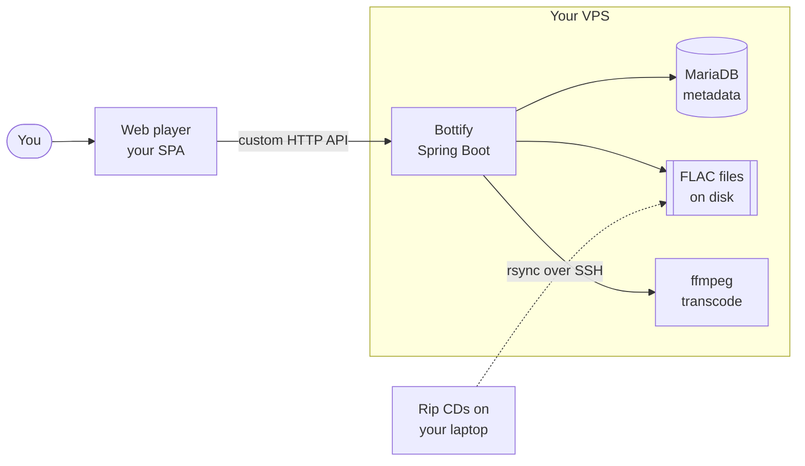
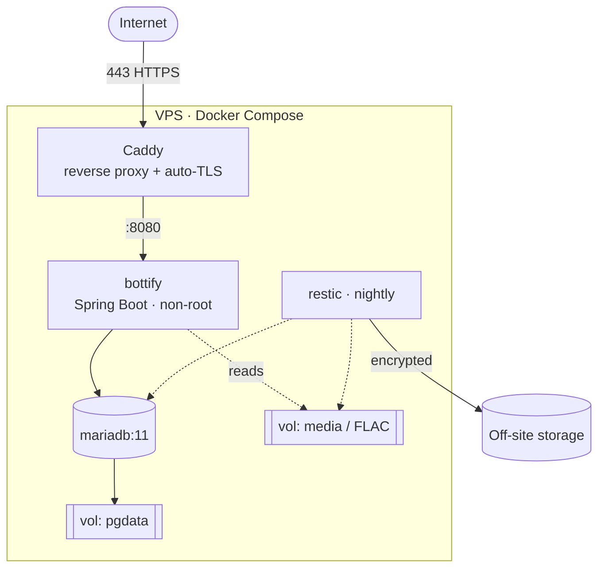
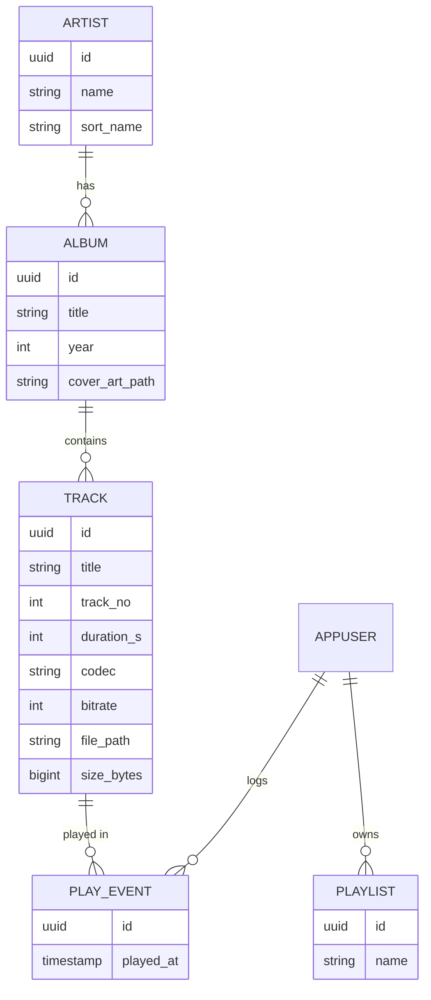

# Bottify — Architecture Overview

> A private, single-user CD streaming server. You rip CDs you own, upload them to your
> own VPS, and stream them to your browser. Built from scratch, primarily as a learning
> project.

This document is the high-level map. The *reasoning* behind the significant choices lives
in the [Architecture Decision Records](../adr/README.md) — this overview links to them
rather than repeating the justifications.

## Locked decisions

| Aspect | Choice | Rationale |
|--------|--------|-----------|
| Users | Single user (you) | — |
| Hosting | One Linux VPS | [ADR-0002](../adr/0002-single-vps-modular-monolith.md) |
| Shape | Modular monolith (no k8s / microservices) | [ADR-0002](../adr/0002-single-vps-modular-monolith.md) |
| API & clients | **Custom API + custom web player** (not Subsonic) | [ADR-0003](../adr/0003-build-custom-api-not-subsonic.md) |
| Backend | Java 25 / Spring Boot 4.0.x | [ADR-0004](../adr/0004-java-spring-boot-backend.md) |
| Metadata store | MariaDB 11 LTS (Flyway migrations) | [ADR-0005](../adr/0005-mariadb-metadata-files-on-disk.md) |
| Audio store | FLAC files on the filesystem | [ADR-0005](../adr/0005-mariadb-metadata-files-on-disk.md) |
| Search | Deferred to a dedicated Elasticsearch service (later phase) | — |
| Delivery | Store lossless, transcode on the fly (ffmpeg) | [ADR-0006](../adr/0006-lossless-storage-on-the-fly-transcode.md) |
| Deployment | Docker Compose behind Caddy (auto-TLS) | [ADR-0007](../adr/0007-docker-compose-caddy-deployment.md) |

> **Note:** Because Bottify uses a custom API rather than Subsonic, the web browser is the
> **only** client. Third-party player apps won't work unless a Subsonic-compatible adapter
> is added later — see [ADR-0003](../adr/0003-build-custom-api-not-subsonic.md).

## System context

*Dashed = one-time ingest path · solid = live streaming path.*

## Internal modules

A single deployable app, cleanly separated inside:

- **Library** — watches the media directory, reads tags via JAudiotagger, extracts cover
  art, builds the artist → album → track catalog. Idempotent rescans.
- **Streaming** — serves audio with HTTP range requests (seeking); chooses direct-play
  vs. transcode.
- **Transcoder** — invokes `ffmpeg` via `ProcessBuilder`, streaming output to the
  response; on-disk cache keyed by `(track, format, bitrate)`.
- **API** — the custom HTTP endpoints the web player consumes.
- **Auth & sessions** — Spring Security; session/JWT login, bcrypt-hashed credentials.
- **Web player** — the SPA client (browse, queue, play, seek, search, playlists).

## Deployment topology

| Service | Image | Role | Exposed |
|---------|-------|------|---------|
| caddy | `caddy:2` | TLS termination, reverse proxy, security headers | 80, 443 |
| bottify | your build (GHCR) | The app; ffmpeg baked in | internal only |
| mariadb | `mariadb:11` | Metadata, users, playlists, history | internal only |
| backup | `restic` + cron | Encrypted nightly snapshots off-site | none |

See [ADR-0007](../adr/0007-docker-compose-caddy-deployment.md).

## Data model

Playlist membership is a join table with track ordering (omitted above for clarity).
Metadata lives in MariaDB; audio stays on disk — [ADR-0005](../adr/0005-mariadb-metadata-files-on-disk.md).

## Getting CDs in

The fastest path to listening is to rip and tag on your laptop, then sync files to the
server — no in-app upload needed at first.

1. **Rip** each CD to FLAC with accurate-rip verification (fre:ac / EAC / whipper).
2. **Tag** from MusicBrainz (Picard) so artist/album/track/art are clean.
3. **Sync**: `rsync -av ./music/ user@vps:/srv/bottify/media/`.
4. **Scan**: trigger a library rescan; Bottify reads tags, dedups, updates the catalog.

An in-app drag-and-drop upload page is a natural later feature — it drops files into the
same media folder and fires a scan.

## Search (planned, deferred)

Search is intentionally **not** a job for the relational database. Early on, simple
`LIKE`-style lookups over the small catalog are enough. When richer search is wanted —
fuzzy, typo-tolerant, accent-aware ranking — it will be added as a **dedicated
Elasticsearch service**, indexed from the catalog, rather than by leaning on MariaDB's
full-text features. This is a deliberate choice (also a learning goal) and is the reason
the database engine was chosen on operational grounds, not text-search capability —
see [ADR-0005](../adr/0005-mariadb-metadata-files-on-disk.md).

## Production readiness

- **Observability** — Spring Boot Actuator health/readiness probes, structured JSON logs,
  Micrometer → Prometheus metrics (optional Grafana).
- **Backups** — nightly `restic` (media + `mariadb-dump`), encrypted, off-site; **test restores**.
- **CI/CD** — GitHub Actions builds/tests/scans the image, pushes to GHCR on tag, deploys
  via SSH + `docker compose pull && up -d`.
- **Host hardening** — SSH keys only, firewall (22/80/443), fail2ban, unattended security
  updates.
- **Config** — 12-factor; all config via env/secrets, nothing environment-specific in the image.
- **Reliability** — `restart: unless-stopped`, health-check-driven restarts, resource
  limits so a runaway transcode can't OOM the box.

## Risks & things to decide early

- **Transcoding is CPU-bound.** Fine for one listener on ~2 vCPU, but cache aggressively
  and prefer direct-play — [ADR-0006](../adr/0006-lossless-storage-on-the-fly-transcode.md).
- **Filesystem ↔ catalog consistency.** The scanner is the single reconciler for files
  added/moved/removed out of band — [ADR-0005](../adr/0005-mariadb-metadata-files-on-disk.md).
- **Keep it single-user and private.** Ripping CDs you own for your own private listening
  is a personal-copy scenario; keeping Bottify locked to one authenticated account is the
  clean design. (Not legal advice.)

## Build roadmap

Each phase is usable and de-risks the next. You're streaming your own CDs by Phase 2.

| Phase | Focus | Goal |
|-------|-------|------|
| **0 — Foundation** | VPS + domain + Compose + Caddy TLS + empty Spring Boot app + MariaDB + Flyway | A "hello" build live over HTTPS |
| **1 — Library** | Media folder + JAudiotagger scan → catalog; browse endpoints + cover art | Your catalog served by the API |
| **2 — Playback** | `stream` with range requests (direct-play), then ffmpeg transcode + cache; auth | **Actually listening 🎧** |
| **3 — Web player** | SPA: browse, play, queue, seek; login; search + playlists | Your own front door |
| **4 — Hardening** | Backups + restore test, monitoring, CI/CD, host hardening, resource limits | Set-and-forget reliability |

---

*Prepared 2026-09-13. Decisions are recorded in [`adr/`](../adr/README.md); update this
overview whenever a new ADR is accepted.*
